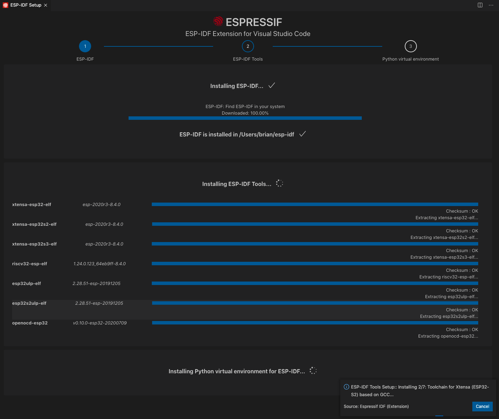

# Install ESP32-IDP on Visual Studio Code:

1. Download and install [Visual Studio Code](https://code.visualstudio.com/).
2. Open the **Extensions** view by clicking on the Extension icon in the Activity Bar on the side of Visual Studio Code or the **View: Extensions** command (shortcut: <kbd>⇧</kbd> <kbd>⌘</kbd> <kbd>X</kbd> or <kbd>Ctrl+Shift+X</kbd>.
3. Search the extension with any related keyword like `espressif`, `esp-idf`, `esp32`, `esp32s2`, etc.
4. Install the extension
   

  

5. In Visual Studio Code, select menu "View" and "Command Palette" and type [configure esp-idf extension]. After, choose the **ESP-IDF: Configure ESP-IDF extension** option. You can also choose where to save settings in the setup wizard.
 

  

  

  

6. Choose **Express** for the fastest option
7. If you choose **Express** setup mode:
    - Pick an ESP-IDF version to download (or find ESP-IDF in your system) and the python executable to create the virtual environment.
    - Choose the location for ESP-IDF Tools and python virtual environment (also known as `IDF_TOOLS_PATH`) which is `$HOME\.espressif` on MacOS/Linux and `%USERPROFILE%\.espressif` on Windows by default.

  

8. The user will see a page showing the setup progress status showing ESP-IDF download progress, ESP-IDF Tools download and install progress as well as the creation of a python virtual environment.

  

9. If everything is installed correctly, the user will see a message that all settings have been configured. You can start using the extension.

  

